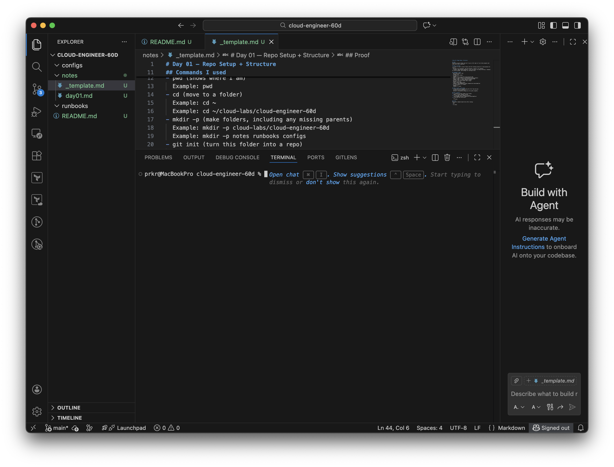

# Day 02 — Filesystem Navigation + Mental Mapping

## Goal
Learn how to move around the Linux filesystem confidently using paths and basic navigation commands.

## What I learned
- A path is like an address for a file or folder.
- Absolute paths start at the root `/` (the top of everything).
- Relative paths start from where I currently am.
- `~` means “my home folder.”
- `..` means “go up one folder.”
- `.` means “this folder.”

## Commands I used (with examples)
- pwd (print working directory)
  Example: pwd
- ls (list files)
  Example: ls
  Example: ls -lah
- cd (change directory)
  Example: cd ~
  Example: cd ..
  Example: cd -
- mkdir -p (make folders)
  Example: mkdir -p labs/day02/{logs,scripts,configs}
- tree (show folder structure as a tree, if installed)
  Example: tree labs/day02

## What I broke / got wrong
- I typed git log --oneline --max-count=5 and Git threw an error because --max-count needs a space (or -n 5). I learned Git flags can be picky.

## How I fixed it
1) I reran the command using the correct format: git log --oneline --max-count 5 (or git log --oneline -n 5).
2) I verified it worked when the commit list printed without errors.

## Proof

### pwd
```bash
prkr@MacBookPro cloud-engineer-60d % pwd
/Users/prkr/cloud-labs/cloud-engineer-60d
- ls -lah (repo root)
prkr@MacBookPro cloud-engineer-60d % ls -lah
total 8
drwxr-xr-x@  8 prkr  staff   256B Jan 11 19:33 .
drwxr-xr-x@  3 prkr  staff    96B Jan 11 12:45 ..
drwxr-xr-x@ 12 prkr  staff   384B Jan 11 19:35 .git
drwxr-xr-x@  2 prkr  staff    64B Jan 11 12:48 configs
drwxr-xr-x@  3 prkr  staff    96B Jan 11 19:33 labs
drwxr-xr-x@  5 prkr  staff   160B Jan 11 19:33 notes
-rw-r--r--@  1 prkr  staff   190B Jan 11 18:25 README.md
drwxr-xr-x@  3 prkr  staff    96B Jan 11 19:30 runbooks
- cd labs/day02 && pwd
prkr@MacBookPro cloud-engineer-60d % cd labs/day02 && pwd
/Users/prkr/cloud-labs/cloud-engineer-60d/labs/day02
- ls -lah (labs/day02)
prkr@MacBookPro day02 % ls -lah
total 0
drwxr-xr-x@ 5 prkr  staff   160B Jan 11 19:33 .
drwxr-xr-x@ 3 prkr  staff    96B Jan 11 19:33 ..
drwxr-xr-x@ 2 prkr  staff    64B Jan 11 19:33 configs
drwxr-xr-x@ 2 prkr  staff    64B Jan 11 19:33 logs
drwxr-xr-x@ 2 prkr  staff    64B Jan 11 19:33 scripts
prkr@MacBookPro day02 % 
'''


## Screenshot

